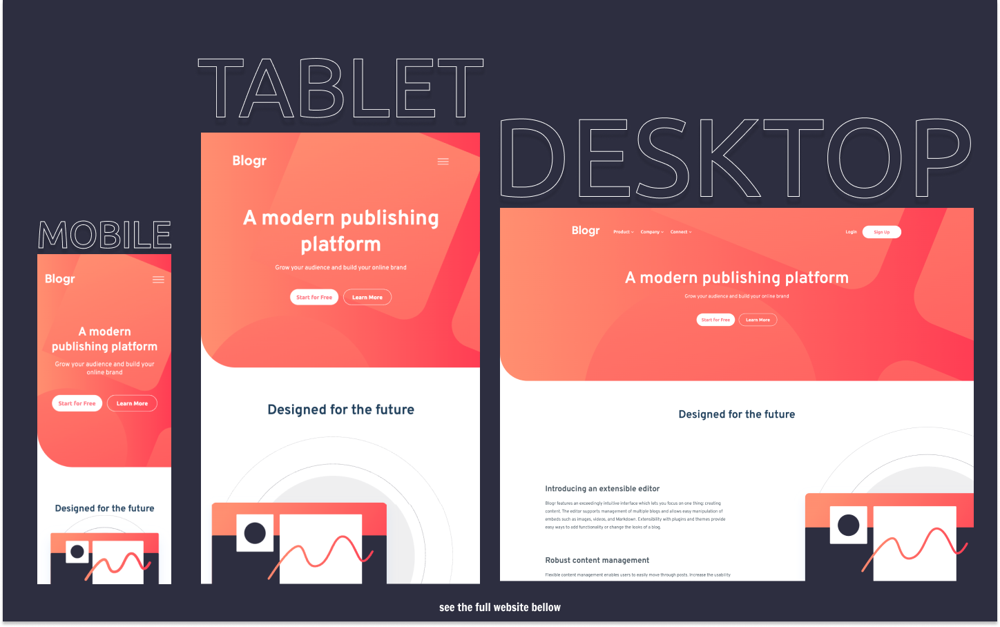

# Frontend Mentor - Blogr Landing Page solution

This is a solution to the [Blogr Landing Page Challenge on Frontend Mentor](https://www.frontendmentor.io/challenges/blogr-landing-page-EX2RLAApP).

## Table of contents

- [Overview](#overview)
  - [The challenge](#the-challenge)
  - [Screenshot](#screenshot)
  - [Links](#links)
- [My process](#my-process)
  - [Built with](#built-with)
  - [What I learned](#what-i-learned)
  - [Useful resources](#useful-resources)
- [Author](#author)

## Overview

### The challenge

Users should be able to:

- View the optimal layout for the site depending on their device's screen size
- See hover states for all interactive elements on the page

### Screenshot

### Links

- Live Site URL: [https://kens-visuals.github.io/blogr-landing-page/](https://kens-visuals.github.io/blogr-landing-page/)
- Solution URL: [https://www.frontendmentor.io/solutions/blogr-landin-page-with-scss-bem-and-vanilla-js-qyv7Cq02-](https://www.frontendmentor.io/solutions/blogr-landin-page-with-scss-bem-and-vanilla-js-qyv7Cq02-)

## My process

### Built with

- Semantic HTML5 markup
- SCSS custom properties
- CSS Flexbox
- CSS Grid
- Vanilla JS
- Mobile-first workflow

### What I learned

Cool landing page, which gives you an opportunity to practice working with menus that also have some sub-menus. However, I'll admit that this is not the cleanest code that I've ever written, and I think I could do a lot better. But I'm not really upset because I was experimenting and trying to do some new things with BEM. Experiments can be expensive sometimes, and this time it was expensive in terms of time. Initially I expected to finish this project in 2 days, but due to experimenting and some other personal things it took me 5-6 days. In brief, I just want to remind everyone that don't get upset if things don't go as planned and your expectations don't come true, because we all learn and grow with those experiments.

## Author

- Frontend Mentor - [@kens-visuals](https://www.frontendmentor.io/profile/kens-visuals)
- Codewars - [@kens_visuals](https://www.codewars.com/users/kens_visuals)
- CodePen - [@kens-visuals](https://codepen.io/kens-visuals)
